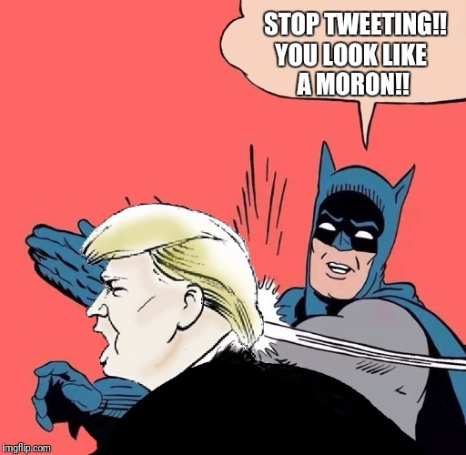

```{r, message=FALSE, warning=FALSE, echo=FALSE}
packages.used=c("rvest", "tibble", "qdap", 
                "sentimentr", "gplots", "dplyr",
                "tm", "syuzhet", "factoextra", 
                "beeswarm", "scales", "RColorBrewer",
                "RANN", "tm", "topicmodels", "wordcloud",
                "tidytext", "plotly", "shiny", "lda", "LDAvis")

# check packages that need to be installed.
packages.needed=setdiff(packages.used, 
                        intersect(installed.packages()[,1], 
                                  packages.used))
# install additional packages
if(length(packages.needed)>0){
  install.packages(packages.needed, dependencies = TRUE)
}

library("rvest")
library("tibble")
library("qdap")
library("sentimentr")
library("gplots")
library("dplyr")
library("tm")
library("syuzhet")
library("factoextra")
library("beeswarm")
library("scales")
library("RColorBrewer")
library("RANN")
library("tm")
library("topicmodels")
library("wordcloud")
library("tidytext")
library("plotly")
library("shiny")
library("lda")
library("LDAvis")
source("../lib/plotstacked.R")
source("../lib/speechFuncs.R")
f.speechlinks=function(html.page, node.type=".ver12 a"){
  urls <- html.page %>% # feed `main.page` to the next step
    html_nodes(node.type) %>% # get the CSS nodes
    html_attr("href") # extract the URLs
  # Get link text
  links <- main.page %>% # feed `main.page` to the next step
    html_nodes(node.type) %>% # get the CSS nodes
    html_text() # extract the link text
  # Combine `links` and `urls` into a data.frame
  out <- data.frame(links = links, urls = urls, stringsAsFactors = FALSE)
  
  return(out)
  
}


```

This notebook was prepared with the following environmental settings.

```{r}
print(R.version)
```


The first step of the report is to use topic modeling on 58 inauguration addresses to get top words used across speeches.
```{r, echo=FALSE}
#Inauguaral speeches
main.page <- read_html(x = "http://www.presidency.ucsb.edu/inaugurals.php")
# Get link URLs
# f.speechlinks is a function for extracting links from the list of speeches. 
inaug=f.speechlinks(main.page)
#head(inaug)
as.Date(inaug[,1], format="%B %e, %Y")
inaug=inaug[-nrow(inaug),] # remove the last line, irrelevant due to error.
# The inauglist contains information of 45 presidents' inauguration address length,
# term and date
inaug.list=read.csv("../data/inauglist.csv", stringsAsFactors = FALSE)
inaug.list=cbind(inaug.list, inaug)

inaug.list$fulltext=NA
for(i in seq(nrow(inaug.list))) {
  text <- read_html(inaug.list$urls[i]) %>% # load the page
    html_nodes(".displaytext") %>% # isloate the text
    html_text() # get the text
  inaug.list$fulltext[i]=text
  # Create the file name
  filename <- paste0("../data/fulltext/", 
                     inaug.list$type[i],
                     inaug.list$File[i], "-", 
                     inaug.list$Term[i], ".txt")
  sink(file = filename) %>% # open file to write 
    cat(text)  # write the file
  sink() # close the file
}

inauguration <- character()
for (i in 1:nrow(inaug.list)) {
  inauguration[i] <- inaug.list$fulltext[i]
}
```


```{r, echo=FALSE}
stop_words <- stopwords("SMART")

# pre-processing:
inauguration <- gsub("'", "", inauguration)  # remove apostrophes
inauguration <- gsub("[[:punct:]]", " ", inauguration)  # replace punctuation with space
inauguration <- gsub("[[:cntrl:]]", " ", inauguration)  # replace control characters with space
inauguration <- gsub("^[[:space:]]+", "", inauguration) # remove whitespace at beginning of documents
inauguration <- gsub("[[:space:]]+$", "", inauguration) # remove whitespace at end of documents
inauguration <- tolower(inauguration)  # force to lowercase

# tokenize on space and output as a list:
doc.list <- strsplit(inauguration, "[[:space:]]+")

# compute the table of terms:
term.table <- table(unlist(doc.list))
term.table <- sort(term.table, decreasing = TRUE)

# remove terms that are stop words or occur fewer than 5 times:
del <- names(term.table) %in% stop_words | term.table < 5
term.table <- term.table[!del]
vocab <- names(term.table)

# now put the documents into the format required by the lda package:
get.terms <- function(x) {
  index <- match(x, vocab)
  index <- index[!is.na(index)]
  rbind(as.integer(index - 1), as.integer(rep(1, length(index))))
}
documents <- lapply(doc.list, get.terms)
```

```{r, echo=FALSE}
# Using the R package 'lda' for model fitting
# Compute some statistics related to the data set:
D <- length(documents)  # number of documents
W <- length(vocab)  # number of terms in the vocab 
doc.length <- sapply(documents, function(x) sum(x[2, ]))  # number of tokens per document 
N <- sum(doc.length)  # total number of tokens in the data 
term.frequency <- as.integer(term.table)  # frequencies of terms in the corpus 

# MCMC and model tuning parameters:
K <- 15
G <- 5000
alpha <- 0.02
eta <- 0.02

# Fit the model:
set.seed(357)
fit <- lda.collapsed.gibbs.sampler(documents = documents, K = K, vocab = vocab, 
                                   num.iterations = G, alpha = alpha, 
                                   eta = eta, initial = NULL, burnin = 0,
                                   compute.log.likelihood = TRUE)

theta <- t(apply(fit$document_sums + alpha, 2, function(x) x/sum(x)))
phi <- t(apply(t(fit$topics) + eta, 2, function(x) x/sum(x)))
InaugReviews <- list(phi = phi,
                     theta = theta,
                     doc.length = doc.length,
                     vocab = vocab,
                     term.frequency = term.frequency)
# library(LDAvis)
# json <- createJSON(phi = InaugReviews$phi, 
#                    theta = InaugReviews$theta, 
#                    doc.length = InaugReviews$doc.length, 
#                    vocab = InaugReviews$vocab, 
#                    term.frequency = InaugReviews$term.frequency)
# serVis(json, out.dir = 'vis', open.browser = FALSE)


ui <- shinyUI(
  fluidPage(
    sliderInput("nTerms", "Number of terms to display", min = 20, max = 40, value = 30),
    visOutput('myChart')
  )
)

server <- shinyServer(function(input, output, session) {
  output$myChart <- renderVis({
    if(!is.null(input$nTerms)){
      with(InaugReviews, 
           createJSON(phi, theta, doc.length, vocab, term.frequency, 
                      R = input$nTerms))
    } 
  })
})

shinyApp(ui = ui, server = server)
```

The above interactive plots are LDavis visulization. Just take a moment and feel free to play with it yourself! (It's unlikely you'll ruin anything) On the left hand side, every circle represents for a topic with a label on them, the area of the circle as well as the number on the circle is encoding prevalence of that topic. The "prevalence" here is computed by the total number of tokens from that topic over the total number of tokens within the entire corpus. (i.e. the bigger the circle, the more prevalent that topic is.)

When you select a topic, what's shown on the right hand side are red bars, which are indications of the total number of times that term appeared in that topic, and the blue bars are the overall frequency of that term within the entire corpus.

Presidential inaugurations are snapshots of U.S. history and tradition. It's the first opportunity for elected leaders to struct his stuff surrounded by historic venues. We can see from above topic modeling that there're several topics every presidents would say at their inauguration speeches. They would address the sagging morale and lack of confidence, be frank and honest about the realities of the economy and wars. America, Freedom, Economy, Government, Jobs, Equality, Reform are the core parts that construct every speech.

After getting the big picture of what topics all the 58 inaugurations would include, let's take individuals into consideration. How's inauguration change through time? Do inaugural represents the speakers? Take Obama and Trump for example, either president's inaugural address should have strong emotional response, since Obama became the first ever black president, and Trump is the first president with absolutly no formal political background.

```{r, echo=FALSE}
folder.path="../data/InauguralSpeeches/"
speeches=list.files(path = folder.path, pattern = "*.txt")
prex.out=substr(speeches, 6, nchar(speeches)-4)

ff.all<-Corpus(DirSource(folder.path))
ff.all<-tm_map(ff.all, stripWhitespace)
ff.all<-tm_map(ff.all, content_transformer(tolower))
ff.all<-tm_map(ff.all, removeWords, stopwords("english"))
ff.all<-tm_map(ff.all, removeWords, character(0))
ff.all<-tm_map(ff.all, removePunctuation)

tdm.all<-TermDocumentMatrix(ff.all)

tdm.tidy=tidy(tdm.all)

tdm.overall=summarise(group_by(tdm.tidy, term), sum(count))
```


```{r, echo = F}
dtm <- DocumentTermMatrix(ff.all,
                          control = list(weighting = function(x)
                                             weightTfIdf(x, 
                                                         normalize =FALSE),
                                         stopwords = TRUE))
ff.dtm=tidy(dtm)
```

# Interactive visualize important words in individual speeches
```{r, warning=FALSE}
library(shiny)

shinyApp(
    ui = fluidPage(
      fluidRow(style = "padding-bottom: 20px;",
        column(4, selectInput('speech1', 'Speech 1',
                              speeches,
                              selected=speeches[5])),
        column(4, selectInput('speech2', 'Speech 2', speeches,
                              selected=speeches[9])),
        column(4, sliderInput('nwords', 'Number of words', 3,
                               min = 20, max = 200, value=100, step = 20))
      ),
      fluidRow(
        plotOutput('wordclouds', height = "400px")
      )
    ),

    server = function(input, output, session) {

      # Combine the selected variables into a new data frame
      selectedData <- reactive({
        list(dtm.term1=ff.dtm$term[ff.dtm$document==as.character(input$speech1)],
             dtm.count1=ff.dtm$count[ff.dtm$document==as.character(input$speech1)],
             dtm.term2=ff.dtm$term[ff.dtm$document==as.character(input$speech2)],
             dtm.count2=ff.dtm$count[ff.dtm$document==as.character(input$speech2)])
      })

      output$wordclouds <- renderPlot(height = 400, {
        par(mfrow=c(1,2), mar = c(0, 0, 3, 0))
        wordcloud(selectedData()$dtm.term1, 
                  selectedData()$dtm.count1,
              scale=c(4,0.5),
              max.words=input$nwords,
              min.freq=1,
              random.order=FALSE,
              rot.per=0,
              use.r.layout=FALSE,
              random.color=FALSE,
              colors=brewer.pal(10,"Blues"), 
            main=input$speech1)
        wordcloud(selectedData()$dtm.term2, 
                  selectedData()$dtm.count2,
              scale=c(4,0.5),
              max.words=input$nwords,
              min.freq=1,
              random.order=FALSE,
              rot.per=0,
              use.r.layout=FALSE,
              random.color=FALSE,
              colors=brewer.pal(10,"Blues"), 
            main=input$speech2)
      })
    },

    options = list(height = 600)
)
```

# How the internet and social media change our president's inaugural?





Well, I guess everyone gets some sense of how social media changes the way people communicates. @POTUS is the official twitter account used by president, (and yes, we also have @FLOTUS run by the first lady). After Trump taking office at the White House, people all notice that he still insisting on keeping his personal twitter handle @realdonaldtrump and not using the @POTUS. Some commentators consider this as a sign that he is continuing on building his "personal brand" instead of speaking from "the office of the president".

As inauguration speeches can be important, they are also easily forgotten. What's the end words Trump used at his inaugural? 

"Together, We Will Make America Strong Again.
We Will Make America Wealthy Again.
We Will Make America Proud Again.
We Will Make America Safe Again.
And, Yes, Together, We Will Make America Great Again. Thank you, God Bless You, and God Bless America."

Trump's contribution to the canon will be remembered for its brevity, pugnacity, and radical departure from precedent - much like the candidate (now president) himself.

So, why don't we do an analysis on the lenght of sentences in the inaugural speeches, and see how the length president chose to use changes through time.

```{r, message=FALSE, warning=FALSE, echo=FALSE}
### Inauguaral speeches
main.page <- read_html(x = "http://www.presidency.ucsb.edu/inaugurals.php")
# Get link URLs
# f.speechlinks is a function for extracting links from the list of speeches. 
inaug=f.speechlinks(main.page)
#head(inaug)
#as.Date(inaug[,1], format="%B %e, %Y")
inaug=inaug[-nrow(inaug),] # remove the last line, irrelevant due to error.
# The inauglist contains information of 45 presidents' inauguration address length,
# term and date
inaug.list=read.csv("../data/inauglist.csv", stringsAsFactors = FALSE)
inaug.list=cbind(inaug.list, inaug)

inaug.list$fulltext=NA
for(i in seq(nrow(inaug.list))) {
  text <- read_html(inaug.list$urls[i]) %>% # load the page
    html_nodes(".displaytext") %>% # isloate the text
    html_text() # get the text
  inaug.list$fulltext[i]=text
  # Create the file name
  filename <- paste0("../data/fulltext/", 
                     inaug.list$type[i],
                     inaug.list$File[i], "-", 
                     inaug.list$Term[i], ".txt")
  sink(file = filename) %>% # open file to write 
  cat(text)  # write the file
  sink() # close the file
}

# Step 4: data Processing --- generate list of sentences
sentence.list=NULL
for(i in 1:nrow(inaug.list)){
  sentences=sent_detect(inaug.list$fulltext[i],
                        endmarks = c("?", ".", "!", "|",";"))
  if(length(sentences)>0){
    emotions=get_nrc_sentiment(sentences)
    word.count=word_count(sentences)
    # colnames(emotions)=paste0("emo.", colnames(emotions))
    # in case the word counts are zeros?
    emotions=diag(1/(word.count+0.01))%*%as.matrix(emotions)
    sentence.list=rbind(sentence.list, 
                        cbind(inaug.list[i,-ncol(inaug.list)],
                              sentences=as.character(sentences), 
                              word.count,
                              emotions,
                              sent.id=1:length(sentences)
                              )
    )
  }
}

sentence.list=
  sentence.list%>%
  filter(!is.na(word.count)) 

# There're 5647 rows in sentence.list.

sel.comparison=c("DonaldJTrump","JohnMcCain", "GeorgeBush", "MittRomney", "GeorgeWBush",
                 "RonaldReagan","AlbertGore,Jr", "HillaryClinton","JohnFKerry", 
                 "WilliamJClinton","HarrySTruman", "BarackObama", "LyndonBJohnson",
                 "GeraldRFord", "JimmyCarter", "DwightDEisenhower", "FranklinDRoosevelt",
                 "HerbertHoover","JohnFKennedy","RichardNixon","WoodrowWilson", 
                 "AbrahamLincoln", "TheodoreRoosevelt", "JamesGarfield", 
                 "JohnQuincyAdams", "UlyssesSGrant", "ThomasJefferson",
                 "GeorgeWashington", "WilliamHowardTaft", "AndrewJackson",
                 "WilliamHenryHarrison", "JohnAdams")


sentence.list.sel=sentence.list%>%filter(File%in%sel.comparison, Term==1)
sentence.list.sel$File=factor(sentence.list.sel$File)

sentence.list.sel$FileOrdered=reorder(sentence.list.sel$File, 
                                  sentence.list.sel$word.count, 
                                  mean, 
                                  order=T)


beeswarm(word.count~FileOrdered, 
         data=sentence.list.sel,
         horizontal = TRUE,
         pch=16, col=alpha(brewer.pal(9, "Set1"), 0.6), 
         cex=0.6, cex.axis=0.7, cex.lab=0.8,
         spacing=5/nlevels(sentence.list.sel$FileOrdered),
         las=1, ylab="", xlab="Number of words in a sentence.",
         main="Inaugural Speeches")

```

The picture shows the number of words in a sentence that is used in the inaugural speeches. Here I reordered the president's name so that from top to bottom the average number of words in a sentence used by the president decreases. We can find that Trump is at the very bottom of the list, hummm, just as what we've expected! So why not do a calculation on the average words per sentence for Trump and Obama?

```{r}
mean(sentence.list.sel$word.count[sentence.list.sel$President=="Barack Obama"])
mean(sentence.list.sel$word.count[sentence.list.sel$President=="Donald J. Trump"])
```

Perhaps appropriate for a politician who's mastered the art of the 140-character tweet, Trump spoke in short sentences - about 15 words per sentence, compared with Obama's 2009 address, which averaged 19. 


```{r, echo=FALSE}
x <- unique(inaug.list$President)
x <- x[-20]
y1 <- inaug.list$Words[inaug.list$Term==1]
names(y1) <- x
y2 <- NULL
for (i in inaug.list$President) {
  y2[i] <- ifelse(any(inaug.list$President==i & inaug.list$Term==2) == T, inaug.list$Words[which(inaug.list$President==i & inaug.list$Term==2)], 0)
}
y2[18] <- y2[20] 
y2 <- y2[-20]
data <- data.frame(x, y1, y2)

#The default order will be alphabetized unless specified as below:
data$x <- factor(data$x, levels = data[["x"]])

p <- plot_ly(data, x = ~x, y = ~y1, type = 'bar', name = 'First Term', marker = list(color = 'rgb(49,130,189)')) %>%
  add_trace(y = ~y2, name = 'Second Term', marker = list(color = 'rgb(204,204,204)')) %>%
  layout(xaxis = list(title = "", tickangle = -45),
         yaxis = list(title = ""),
         margin = list(b = 100),
         barmode = 'group')

# Create a shareable link to your chart
# Set up API credentials: https://plot.ly/r/getting-started
#chart_link = plotly_POST(p, filename="bar/rotated")
#chart_link

```

Let's also look at the interactive bar chart for a more visual sense of how the length of inauguration speeches change across presidents.
```{r}
p
```

First let's take a look at the outstanding 8460 words inaugural speech! William Henry Harrison, the ninth President of the united states, who was 68 years, 23 days old at the time of his inauguration delivered the speech. Another thing you may want to learn about this president who had the longest (2 hrs) inaugural address to date is that he died of complications from pnenumonia 31 days into his term, serving the shortest tenure in United States presidential history. He was the first president to die in office.

Then, back to our 45th President of the United States. From the plot we can get that Trump's address was considerably shorter than both of his predecessors' speeches, clocking in at just over 16 minutes. The speech was heavy on slogans and promises familiar from his campaign, stuffed with patriotic themes and free from the traditional arc, pacing, and rhetorical ambition of most modern inaugurals.

### It was uniquely Trumpian.

As he did during the campaign, Trump repurposed several famous phrases with tangled historical resonance and made them his own: "America first" and "forgotten man."


